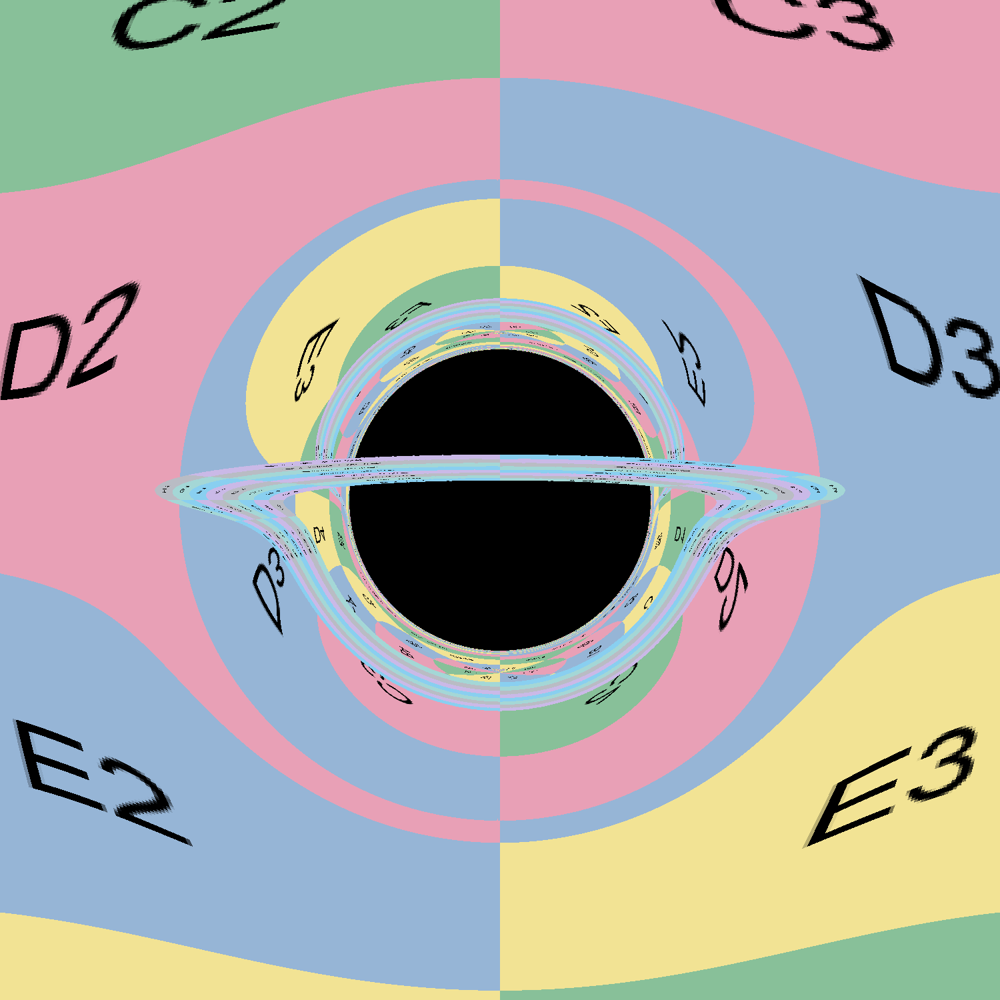

# General Relativity Raytracer

This is a raytracer for general relativity, which can be used to visualize the effects of gravity on light paths. It is
based on the principles of general relativity and uses numerical methods to solve the geodesic equations.

It is based on the
paper [Seeing relativity -- I. Ray tracing in a Schwarzschild metric to explore the maximal analytic extension of the metric and making a proper rendering of the stars](https://arxiv.org/abs/1511.06025).

# How to render an image

There are various predefined geometries, defined via TOML-files:

- `euclidean-spherical.toml`
- `euclidean.toml`
- `schwarzschild.toml`

These can be used to render an image of the described setup via

```ah
cargo run --release -- --width=1500 --height=1500 --camera-position=0.0,0.8,-10.0  --config-file schwarzschild.toml render --filename=render.png
```

where `--width` and `--height` define the resolution, the camera position can be adapted via `--camera-position`.
Call the command `render` to render a full image which will be saved to a file given by `--filename`.

# Scripts

There are various scripts. Some of them create importable CSV files, others create images and animations based
on [Manim](https://github.com/3b1b/manim).

## Create rays to be plotted.

- `scripts/create_rays_positions.sh`: Creates rays in a Schwarzschild metric based on a given position and direction and
  saves them to a CSV file in the directory `rays/`.
- `scripts/create_rays_from_camera.sh`: Creates rays in a Schwarzschild metric using the camera given its position and
  a selected pixel. The data will be saved to a CSV file in the directory `rays/`.

## Plot rays.

Running `python -m manim scripts/animate-rays/main.py AnimateRays` will create an animation of the rays saved in
CSV files in the directory `rays/`.

# Examples

## Plot of a Schwarzschild black hole with a accretion disk

Plot of the Schwarzschild solution with a accretion disk using a checkerboard texture to visualize the relations.


## Video of rays in a Schwarzschild metric

https://github.com/user-attachments/assets/c1ce889b-6186-4ce5-b613-fecae3af03ef

# Video of flying over a Schwarzschild black hole

https://github.com/user-attachments/assets/914d3134-53db-4084-8a5f-1728d8460594

The background is: https://commons.wikimedia.org/wiki/File:Messier_object_025.jpg

# Video of lensing due to a Schwarzschild black hole

This shows a Schwarzschild black hole with a spherical object behind it and its lensing effects when moving around.

https://github.com/user-attachments/assets/6907c6a2-970a-4d19-be60-5e0f6f340709

The background is: https://commons.wikimedia.org/wiki/File:Messier_object_025.jpg
