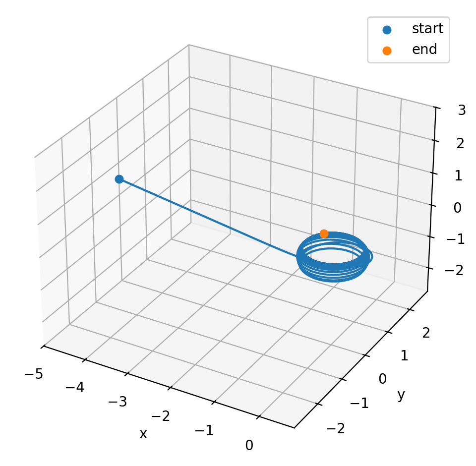

# General Relativity Raytracer

<p align="center">
  
</p>

This is a raytracer for general relativity, which can be used to visualize the effects of gravity on light paths. It is
based on the principles of general relativity and uses numerical methods to solve the geodesic equations.

It is inspired by the
paper [Seeing relativity -- I. Ray tracing in a Schwarzschild metric to explore the maximal analytic extension of the metric and making a proper rendering of the stars](https://arxiv.org/abs/1511.06025)
and takes various formulas from it. Additional inspiration came
from [BlackHoleViz_v2](https://github.com/HollowaySean/BlackHoleViz_v2).

See [Image Gallery](/images/images.md) for a gallery of renders created with this raytracer.

## Feature Snapshot

- Multi-geometry raytracing: Euclidean, EuclideanSpherical, Schwarzschild, Kerr.
- Geodesic integration with RKF45.
- Relativistic effects in shading: gravitational/Doppler redshift and beaming.
- Physically motivated emission: black-body spectrum integration in CIE XYZ.
- Various scene primitives: Sphere, Disc, and Perlin-noise-based VolumetricDisc.
    - Note that the volumetric disc is not physically motivated, but rather a visual effect to create a more volumetric
      appearance of the accretion disk.
- Flexible materials/textures: Bitmap, Checker, and BlackBody mappers.
- High-fidelity outputs: standard image export plus HDR (`.hdr`) support.
- Debug/inspection tooling: per-pixel ray export and arbitrary ray-at-position export.
- Config-driven scenes via TOML with pluggable geometry, textures, and objects.

## How to render an image

There are various predefined geometries, defined via TOML-files in the
directory [scene-definitions](/scene-definitions).

These can be used to render an image of the described setup via

```ah
cargo run --release -- --width=1500 --height=1500 --camera-position=10.0,0.0,0.8  --config-file scene-definitions/schwarzschild.toml render --filename=render.png
```

where `--width` and `--height` define the resolution, the camera position can be adapted via `--camera-position`.
Call the command `render` to render a full image which will be saved to a file given by `--filename`.

## Scripts

There are various scripts. Some of them create importable CSV files, others create images and animations based
on [Manim](https://github.com/3b1b/manim).

### Create rays to be plotted.

- `scripts/create_rays_positions.sh`: Creates rays in a Schwarzschild metric based on a given position and direction and
  saves them to a CSV file in the directory `rays/`.
- `scripts/create_rays_from_camera.sh`: Creates rays in a Schwarzschild metric using the camera given its position and
  a selected pixel. The data will be saved to a CSV file in the directory `rays/`.

### Plot rays.

Running `python -m manim scripts/animate-rays/main.py AnimateRays` will create an animation of the rays saved in
CSV files in the directory `rays/`.

## Examples

### Plot of a Schwarzschild black hole with a accretion disk

Plot of the Schwarzschild solution with a accretion disk using a checkerboard texture to visualize the relations.
<p align="center">
  
</p>

### Video of rays in a Schwarzschild metric

https://github.com/user-attachments/assets/c1ce889b-6186-4ce5-b613-fecae3af03ef

### Video of flying over a Schwarzschild black hole

https://github.com/user-attachments/assets/914d3134-53db-4084-8a5f-1728d8460594

The background is: https://commons.wikimedia.org/wiki/File:Messier_object_025.jpg

### Video of lensing due to a Schwarzschild black hole

This shows a Schwarzschild black hole with a spherical object behind it and its lensing effects when moving around.

https://github.com/user-attachments/assets/6907c6a2-970a-4d19-be60-5e0f6f340709

The background is: https://commons.wikimedia.org/wiki/File:Messier_object_025.jpg

## Examples

### Kerr black hole with accretion disk

The parameters are

```sh
gr_raytracer --width=500 --height=500 --max-steps=1000000 --camera-position=-10,0,-0.5 --theta=1.52 --psi=-1.57 --phi=0 --config-file scene-definitions/kerr.toml render
```

Note the large number of max-steps required to get a good image, due to the complex light paths around a Kerr black
hole.

#### Example 1

Example of a Kerr black hole with a radius r_s = 1.0 and a = 0.5.

<p align="center">
  
</p>

##### Trajectories

Create a trajectory near the horizon like this:

```sh
gr_raytracer --width=501 --height=501 --max-steps=1000000 --camera-position=-5,0,0.5 --theta=1.57 --psi=1.57 --phi=0 --config-file scene-definitions/kerr.toml render-ray --col=195 --row=250
```

Example of a trajectory of Kerr black hole with a radius r_s = 1.0 and a = 0.5 near the horizon.

<p align="center">
  
</p>

#### Example 2

Example of a Kerr black hole with a radius r_s = 1.0 and a = 0.51.

<p align="center">
  
</p>

### Animation of increasing spin parameter a of Kerr black hole

This animations shows a Kerr black hole with r_s = 1.0 and increasing spin parameter a from 0.0 to 0.5.

<p align="center">
  
</p>

## Sources

- [Seeing relativity -- I. Ray tracing in a Schwarzschild metric to explore the maximal analytic extension of the metric and making a proper rendering of the stars](https://arxiv.org/abs/1511.06025)
- [BlackHoleViz_v2](https://github.com/HollowaySean/BlackHoleViz_v2).
- Novikov, I. D., & Thorne, K. S. (1973). *Astrophysics of black holes*. In C. DeWitt & B. S. DeWitt (Eds.), *Black
  Holes (Les Astres Occlus)*, p.
  343. [Chapter bibliographic entry](https://cir.nii.ac.jp/crid/1370025430666224928), [Book record](https://lccn.loc.gov/73169355).
- https://commons.wikimedia.org/wiki/File:Messier_object_025.jpg
