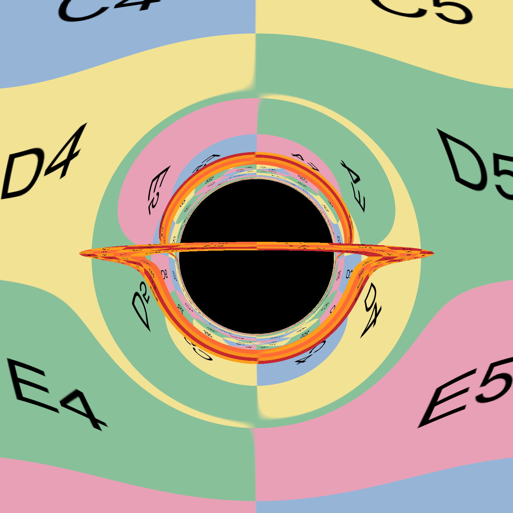
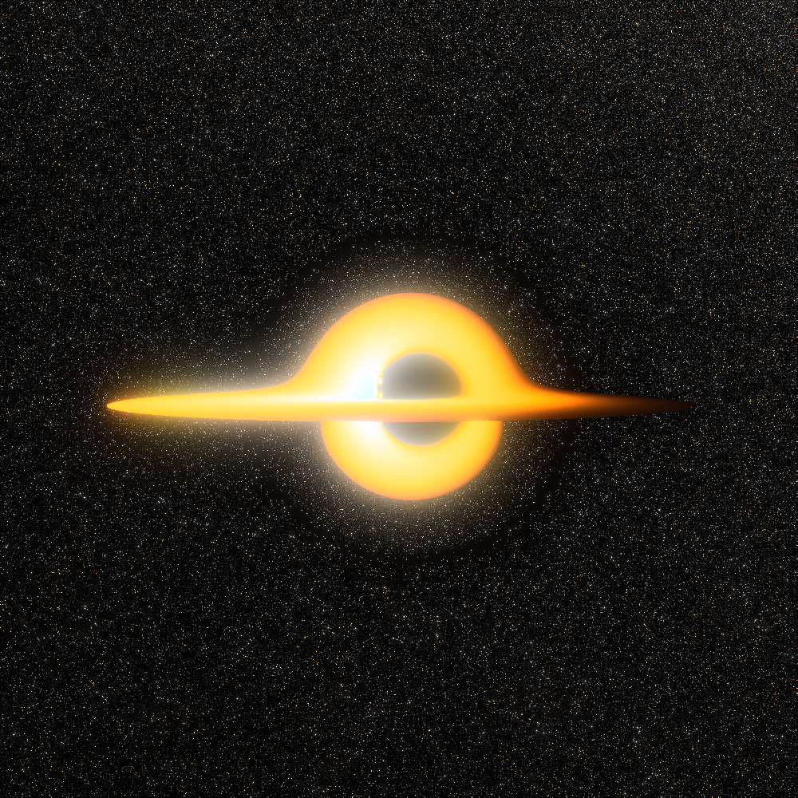
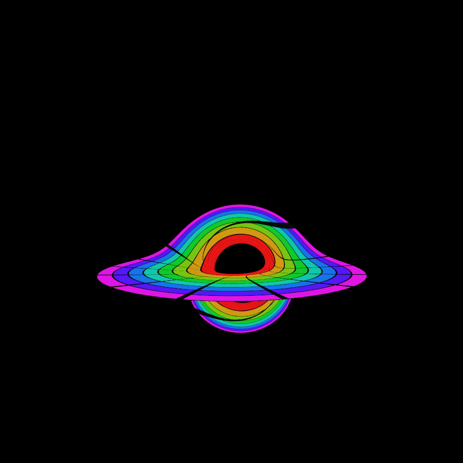

# Image Gallery

The gallery is split into one page per topic:

## [Schwarzschild Black Hole](schwarzschild.md)

  
  
Lensing and volumetric renders of the non-rotating black hole.

## [Kerr Black Hole](kerr.md)

  
  
Checkerboard, blackbody, and volumetric discs; animations; ray trajectories.

## [Showcase](showcase.md)

  
  
Paired renders with synthetic textures isolating shadow shape, frame dragging, and lensing image orders; reproducible via <code>images/create-showcase-images.sh</code>.

