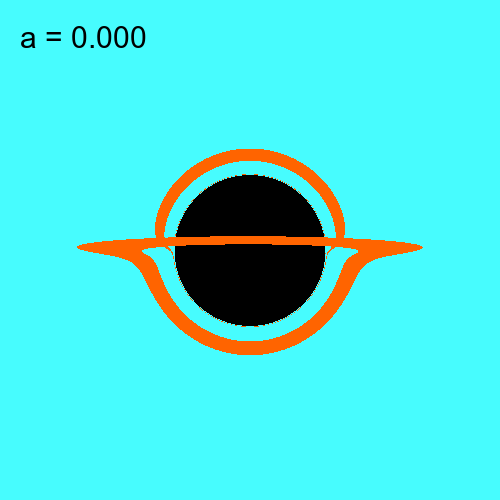

# Image Gallery

## Schwarzschild Black Hole

### Checkerboard Accretion Disk

  
  
Schwarzschild black hole with a checkerboard accretion disk showing gravitational lensing effects

### Volumetric Rendering

  
  
Schwarzschild black hole visualization with volumetric light scattering effects

## Kerr Black Hole

### Checkerboard Accretion Disk

  
  
Kerr black hole with high spin parameter and a checkerboard accretion disk

  
  
Kerr black hole with a checkerboard accretion disk showing frame dragging and lensing

### Blackbody Radiation

  
  
Kerr black hole with an accretion disk rendered using blackbody radiation spectrum (view 1)

  
  
Kerr black hole with an accretion disk rendered using blackbody radiation spectrum (view 2)

  
  
Kerr black hole with spin parameter a=0.5 and a blackbody accretion disk (view 1)

  
  
Kerr black hole with spin parameter a=0.5 and a blackbody accretion disk (view 2)

### Volumetric Rendering

  
  
Kerr black hole with a checkerboard disk and volumetric rendering of the surrounding medium

  
  
Kerr black hole visualization with background stars and volumetric scattering

### Animations

  
  
Animation of a spinning Kerr black hole with a rotating accretion disk

  
  
Animation of a Kerr black hole with background stars and a rotating accretion disk

### Trajectories

  
  
Visualization of a ray trajectory approaching the event horizon of a Kerr black hole

