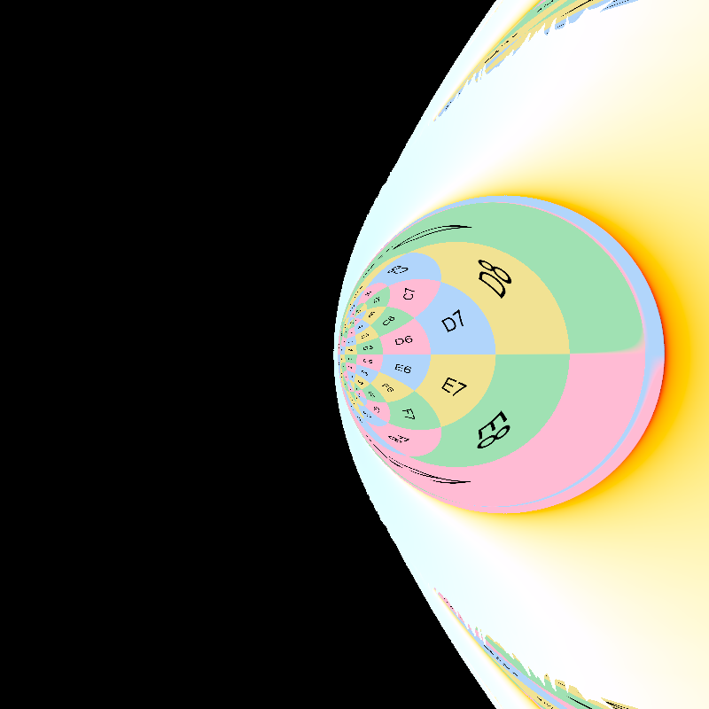
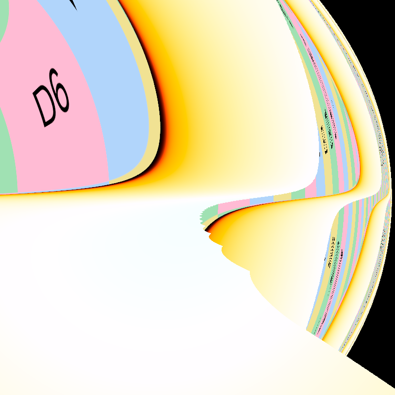
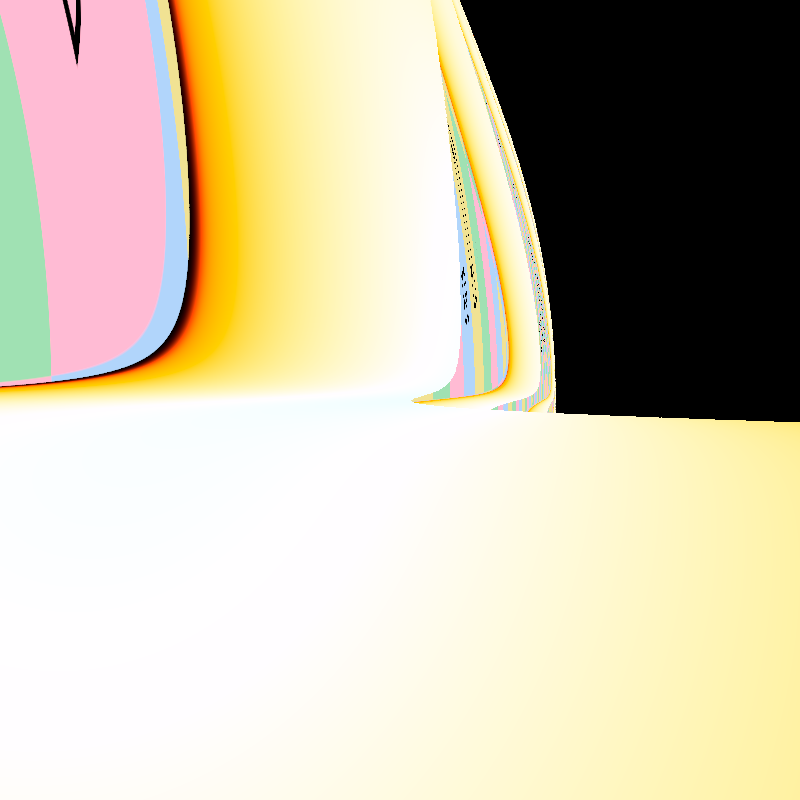
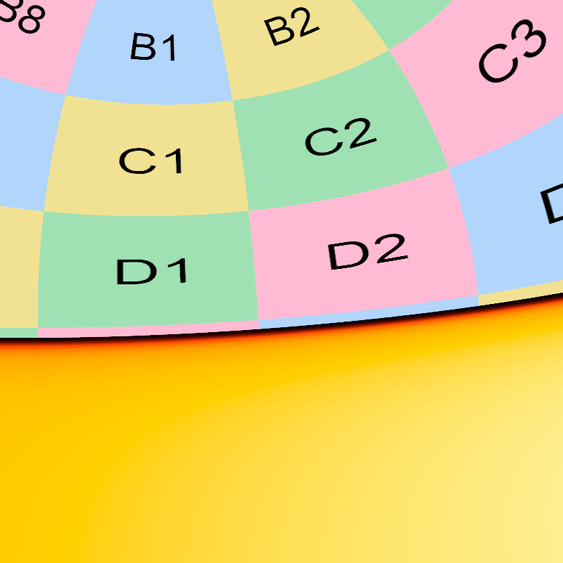
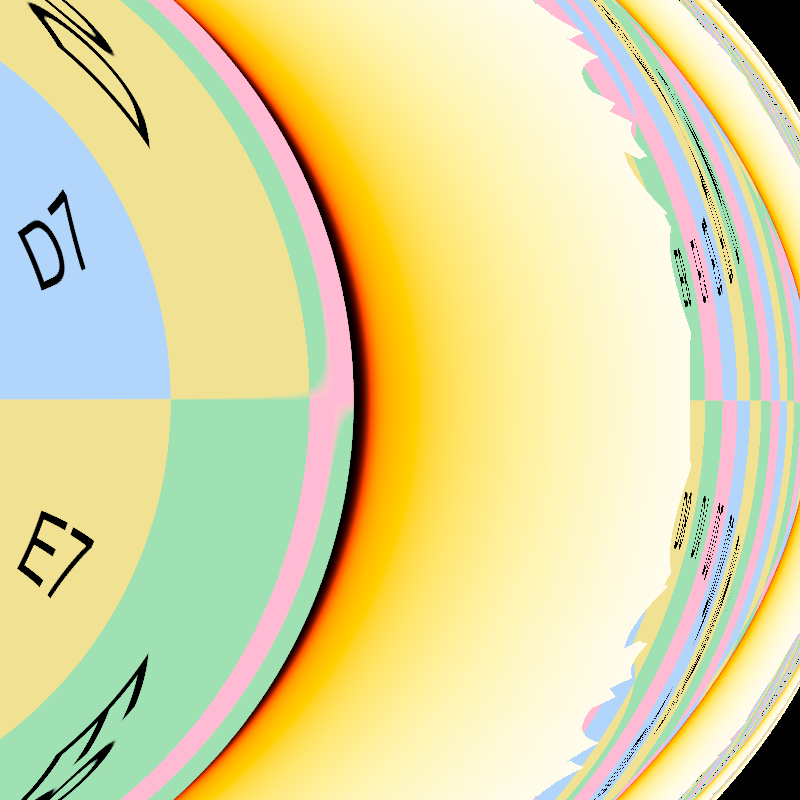
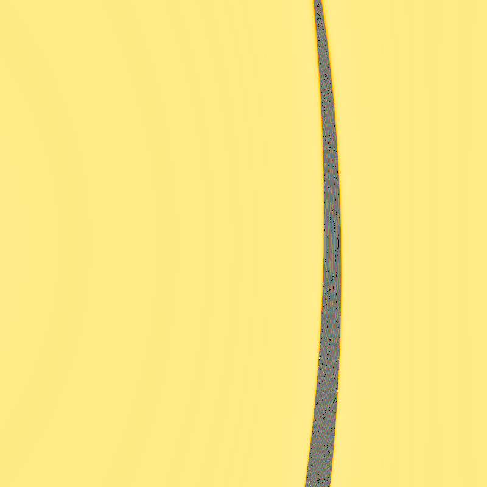
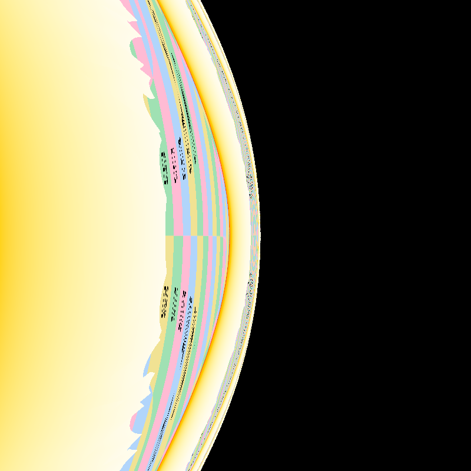
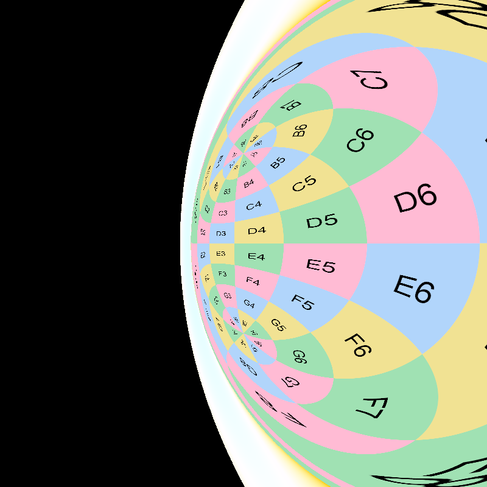

# Kerr Black Hole

[← Back to the gallery index](images.md)

All still images on this page are reproducible: `images/create-gallery-images.sh`
(checkerboard and volumetric renders, grid animation),
`images/create-showcase-images.sh` (showcase section), and
`scripts/rendering/create_kerr_images.sh` (spin-sweep animations).

### Checkerboard Accretion Disk

  
  
Super-extremal Kerr (a = 0.55 &gt; M): a naked singularity. With no horizon there is no shadow; where the black disc would be, you see light that passed arbitrarily close to the singularity, wound into a chaotic core.

  
  
Kerr black hole with a checkerboard accretion disk showing frame dragging and lensing

### Blackbody Radiation

Two vantages on a Novikov-Thorne blackbody disc: a distant view of the
full system and a close-up where the shadow dominates and the disc wraps
over the top. The pairs differ in disc temperature (8000 K vs 4000 K)
and spin: the red pair sits at a = 0.4995, essentially extremal.

  
  
Hot (8000 K) blackbody disc at a = 0.499, distant view (background image: <a href="https://commons.wikimedia.org/wiki/File:Messier_object_025.jpg">M25</a>)

  
  
The same disc up close: the shadow dominates, the disc wraps over the top, and the approaching side is visibly blueshifted

  
  
Cool (4000 K) blackbody disc at a = 0.4995 (essentially extremal; exactly a = M is degenerate as the ISCO meets the photon orbit), distant view

  
  
The extremal-limit disc up close

### Volumetric Rendering

  
  
Kerr black hole with a checkerboard disk and volumetric rendering of the surrounding medium

  
  
Kerr black hole visualization with background stars and volumetric disc (background image: <a href="https://commons.wikimedia.org/wiki/File:NGC6355_-_HST_-_Potw2301a.jpg">NGC 6355</a>)

### Accretion-disc temperature series

The main-image scene (see `images/create-main-image.sh`) rendered at three
peak disc temperatures. Lensing and camera are identical; only the
Novikov-Thorne calibration target changes, with `--exposure` compensating
the (T/T_ref)^4 brightness difference so the frames stay comparable.

  
  
8000 K (exposure 5): deep amber; the cool outskirts thin toward transparency, stars showing through.

  
  
12000 K (exposure 1): the previous main-image temperature; pale gold, fully luminous end to end.

  
  
20000 K (exposure 0.13): pale ivory with a blue-white core. At matched brightness the frame is only mildly hotter-looking than 12000 K, because the visible-band blackbody chromaticity converges toward blue-white above ~10000 K; most of what higher temperature buys here is radiance, not color.

### Photon-ring windings

  
  
6x zoom onto the shadow's limb (12000 K scene): successive lensed images of the disc wind around the photon ring, each order ~23x thinner than the last (surface brightness is conserved, so each stays at full luminance until it falls below pixel scale; the grainy fringe is every deeper order averaging inside single pixels).

  
  
The control: the identical crop with the disc removed. The smooth boundary is the critical curve (its long straight stretch is the near-extremal "D-shape" flattening of the prograde limb at a/M = 0.998), and the faint concentric striations hugging it are the photon ring itself with only starlight as its source. Every winding in the image above slots into this scaffolding; same geometry, hot gas instead of faint stars as the paint.

### Animations

  
  
Animation of a spinning Kerr black hole with a rotating accretion disk

  
  
Animation of a Kerr black hole with background stars and a rotating accretion disk (background image: <a href="https://commons.wikimedia.org/wiki/File:Messier_object_025.jpg">M25</a>)

### Close vantages

First-person views near the near-extremal hole (a = 0.499, ZAMO
observer; recipes: `images/create-vantage-images.sh`). The first four
placements mirror the [Schwarzschild series](schwarzschild.md#close-vantages);
frame dragging pulls every one of them into asymmetry. The disc glow is
3500 K gas, blueshifted by the deep gravity well.

  
  
Dragged porthole (just outside the horizon, looking straight out): the Schwarzschild porthole again, but frame dragging squeezes the sky circle off-axis and the plunging inner disc glow floods in from the sides.

  
  
Photon-shell edge, hovering just above the disc surface: the winding wall of stacked disc and sky images, with the glowing surface curving away beneath the camera.

  
  
Grazing view, skimming just above the disc surface inside its annulus: the multiple-winding band, distorted relative to Schwarzschild because prograde and retrograde light circle at different radii around a spinning hole.

  
  
Rearview: the magnified outward sky and the disc band, the near-side gas brightened by Doppler beaming.

  
  
Inside the ergosphere, looking prograde (the direction spacetime itself rotates): the winding wall seen from a region where standing still relative to the stars is impossible.

  
  
From the rotation axis, facing the hole: the disc face-on behind a shadow that stays circular; pole-on, even near-extremal spin barely distorts the silhouette, in contrast to every equatorial view.

  
  
From inside the gap between the disc's inner edge and the horizon, looking back along the orbit: the wound images pile up against the rim of the shadow.

  
  
The same spot, looking straight out: the sky and outer disc compressed into an oval by the gravity of the hole behind the camera.

### Trajectories

  
  
Visualization of a ray trajectory approaching the event horizon of a Kerr black hole

