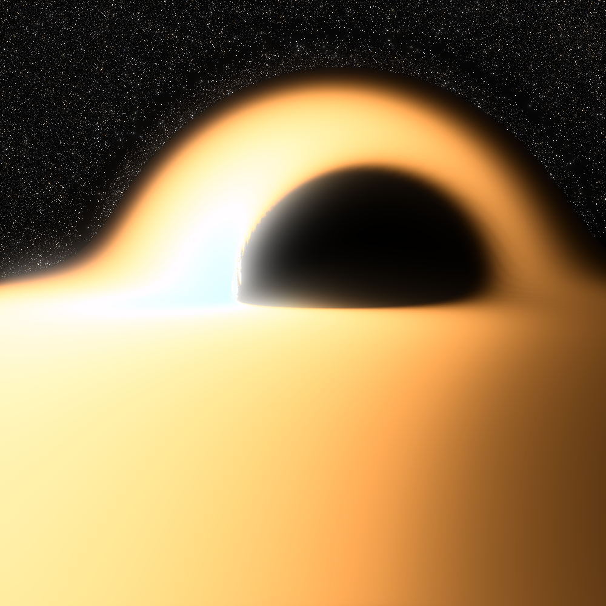
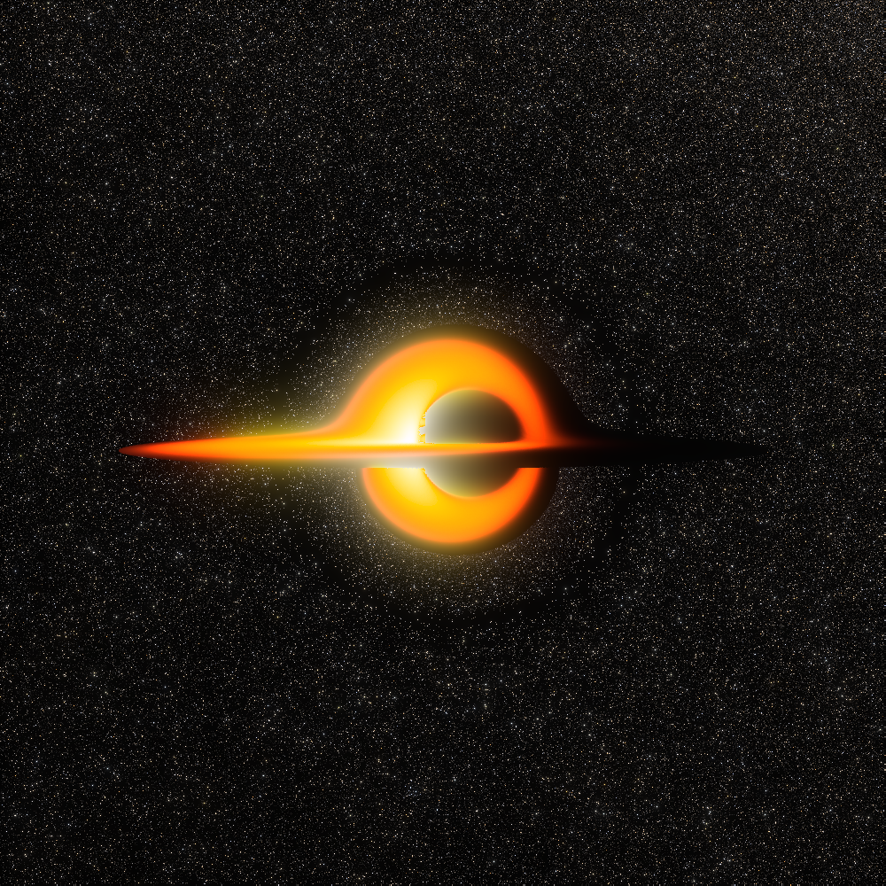
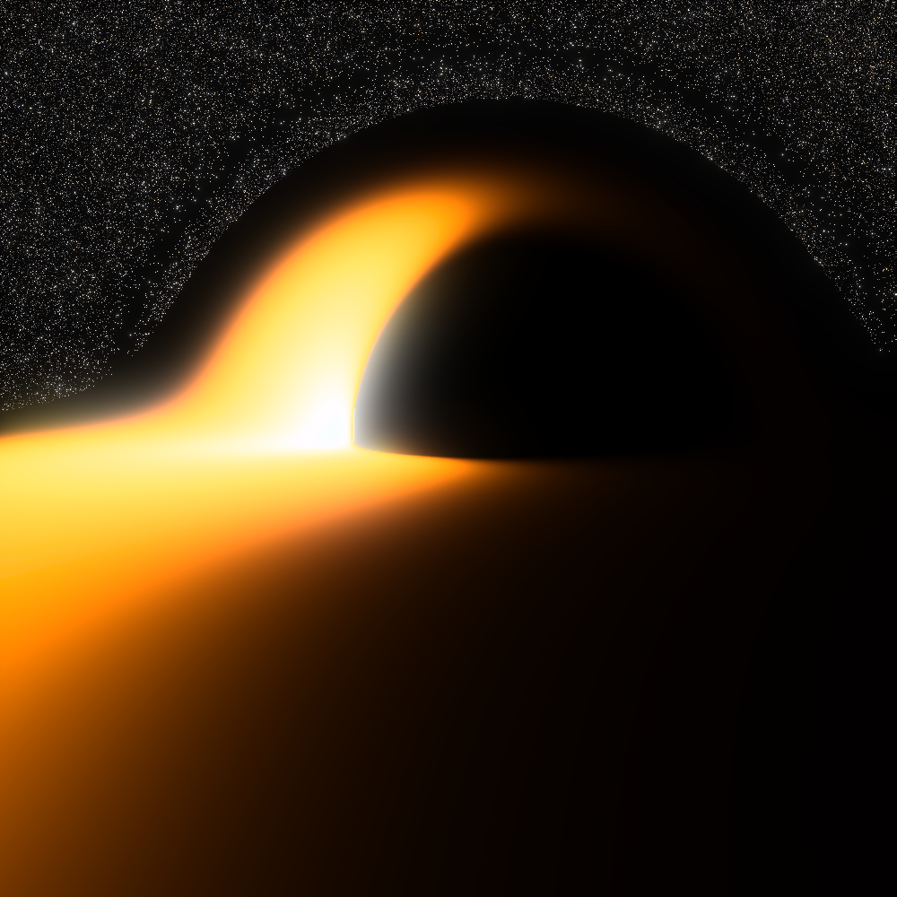

# Kerr Black Hole

[← Back to the gallery index](images.md)

### Checkerboard Accretion Disk

  
  
Kerr black hole with high spin parameter and a checkerboard accretion disk

  
  
Kerr black hole with a checkerboard accretion disk showing frame dragging and lensing

### Blackbody Radiation

  
  
Kerr black hole with an accretion disk rendered using blackbody radiation spectrum (view 1) (background image: <a href="https://commons.wikimedia.org/wiki/File:Messier_object_025.jpg">M25</a>)

  
  
Kerr black hole with an accretion disk rendered using blackbody radiation spectrum (view 2) (background image: <a href="https://commons.wikimedia.org/wiki/File:Messier_object_025.jpg">M25</a>)

  
  
Kerr black hole with spin parameter a=0.5 and a blackbody accretion disk (view 1) (background image: <a href="https://commons.wikimedia.org/wiki/File:Messier_object_025.jpg">M25</a>)

  
  
Kerr black hole with spin parameter a=0.5 and a blackbody accretion disk (view 2) (background image: <a href="https://commons.wikimedia.org/wiki/File:Messier_object_025.jpg">M25</a>)

### Volumetric Rendering

  
  
Kerr black hole with a checkerboard disk and volumetric rendering of the surrounding medium

  
  
Kerr black hole visualization with background stars and volumetric disc (background image: <a href="https://commons.wikimedia.org/wiki/File:NGC6355_-_HST_-_Potw2301a.jpg">NGC 6355</a>)

### Accretion-disc temperature series

The main-image scene (see `images/create-main-image.sh`) rendered at three
peak disc temperatures. Lensing and camera are identical; only the
Novikov-Thorne calibration target changes, with `--exposure` compensating
the (T/T_ref)^4 brightness difference so the frames stay comparable.

  
  
8000 K (exposure 5): deep amber; the cool outskirts thin toward transparency, stars showing through.

  
  
12000 K (exposure 1): the previous main-image temperature; pale gold, fully luminous end to end.

  
  
20000 K (exposure 1): cream-white; maximal visibility, the temperature gradient washed toward uniform brightness.

### Photon-ring windings

  
  
6x zoom onto the shadow's limb (12000 K scene): successive lensed images of the disc wind around the photon ring, each order ~23x thinner than the last (surface brightness is conserved, so each stays at full luminance until it falls below pixel scale; the grainy fringe is every deeper order averaging inside single pixels).

### Animations

  
  
Animation of a spinning Kerr black hole with a rotating accretion disk

  
  
Animation of a Kerr black hole with background stars and a rotating accretion disk (background image: <a href="https://commons.wikimedia.org/wiki/File:Messier_object_025.jpg">M25</a>)

### Trajectories

  
  
Visualization of a ray trajectory approaching the event horizon of a Kerr black hole

