# Kerr Black Hole

[← Back to the gallery index](images.md)

All still images on this page are reproducible: `images/create-gallery-images.sh`
(checkerboard and volumetric renders, grid animation),
`images/create-showcase-images.sh` (showcase section), and
`scripts/rendering/create_kerr_images.sh` (spin-sweep animations).

### Checkerboard Accretion Disk

  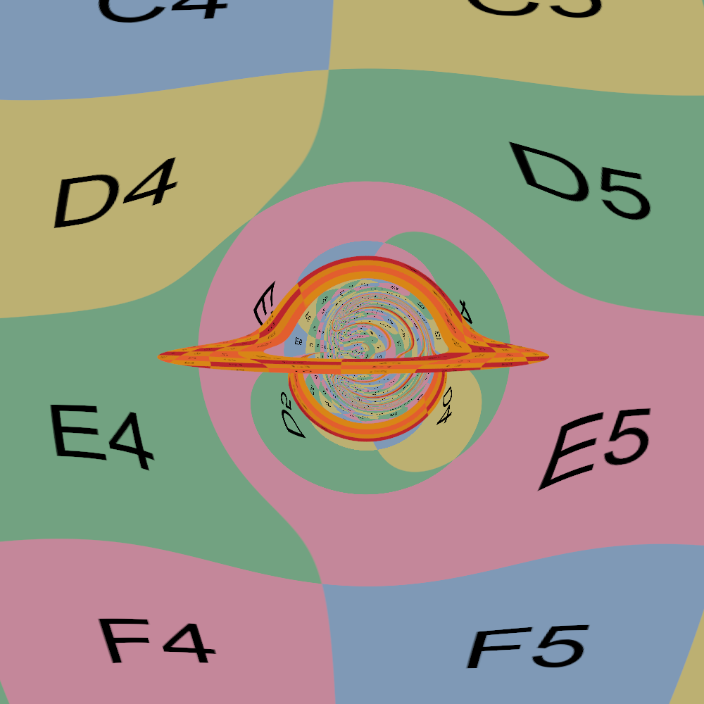
  
Super-extremal Kerr (a = 0.55 &gt; M): a naked singularity. With no horizon there is no shadow; where the black disc would be, you see light that passed arbitrarily close to the singularity, wound into a chaotic core.

  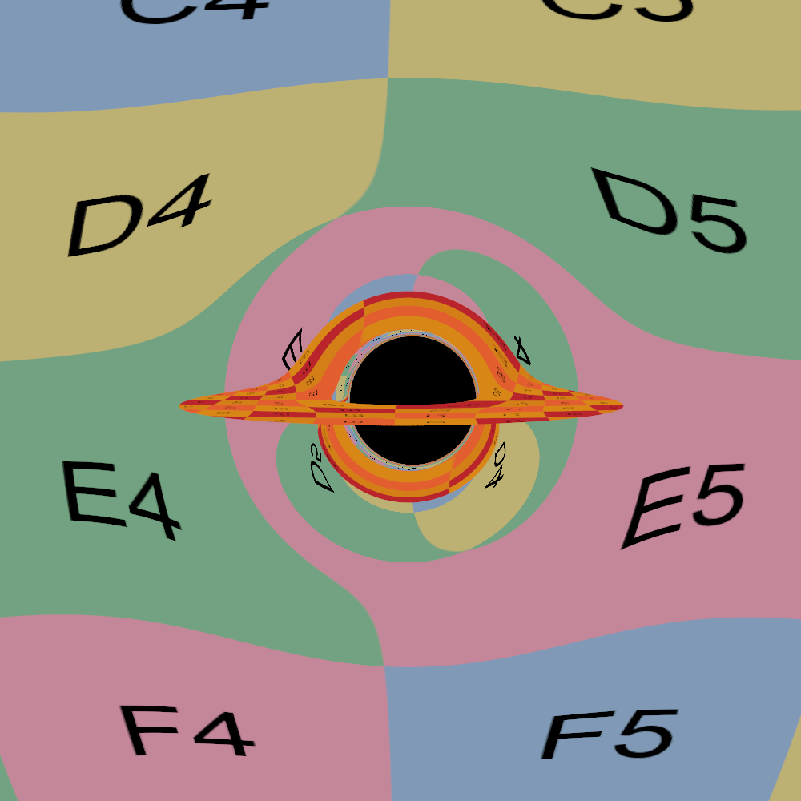
  
Kerr black hole with a checkerboard accretion disk showing frame dragging and lensing

### Volumetric Rendering

  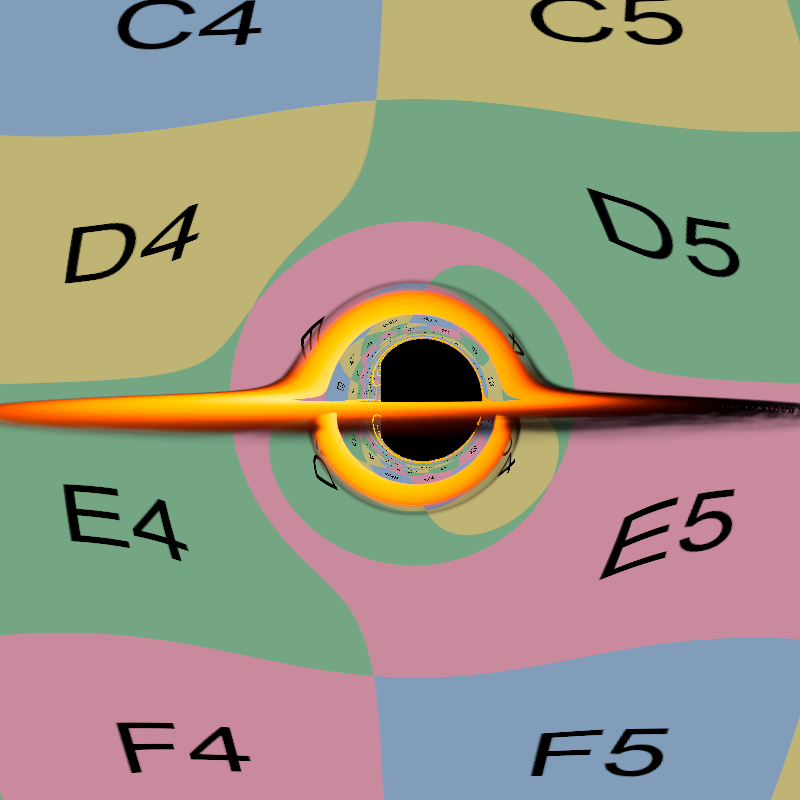
  
Kerr black hole with a checkerboard disk and volumetric rendering of the surrounding medium

  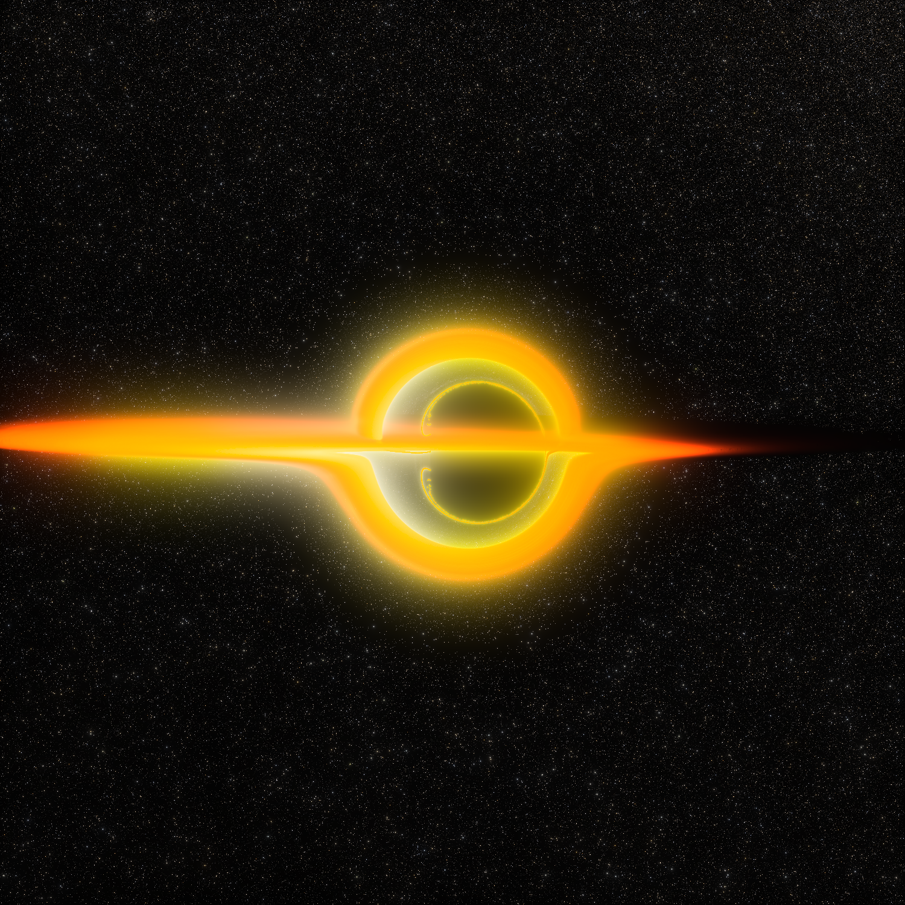
  
Kerr black hole visualization with background stars and volumetric disc (background image: <a href="https://commons.wikimedia.org/wiki/File:NGC6355_-_HST_-_Potw2301a.jpg">NGC 6355</a>)

### Accretion-disc temperature series

The main-image scene (see `images/create-main-image.sh`) rendered at three
peak disc temperatures. Lensing and camera are identical; only the
Novikov-Thorne calibration target changes, with `--exposure` compensating
the (T/T_ref)^4 brightness difference so the frames stay comparable.

  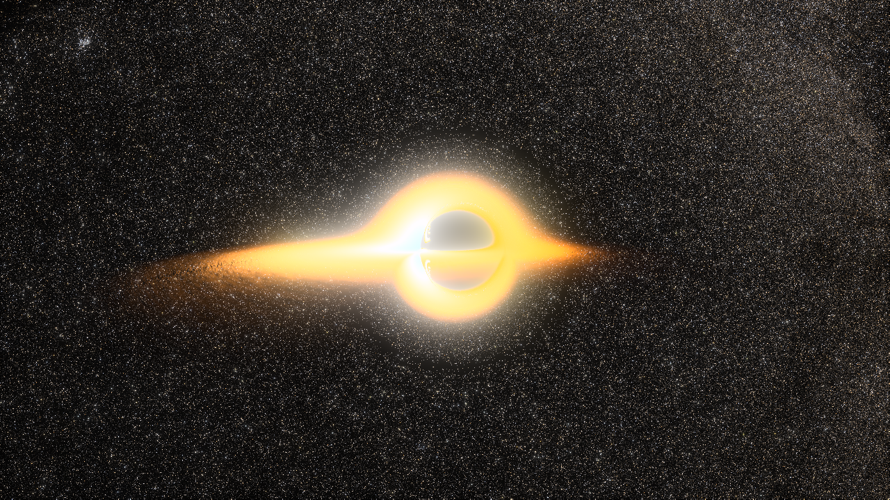
  
8000 K (exposure 5): deep amber; the cool outskirts thin toward transparency, stars showing through.

  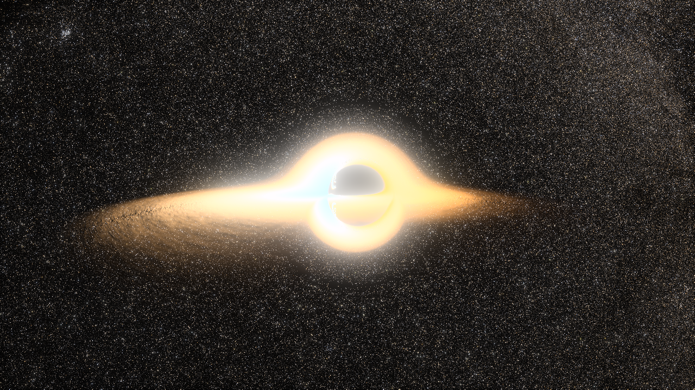
  
12000 K (exposure 1): the previous main-image temperature; pale gold, fully luminous end to end.

  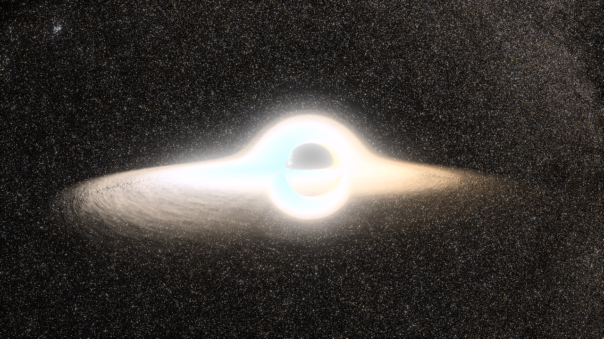
  
20000 K (exposure 0.13): pale ivory with a blue-white core. At matched brightness the frame is only mildly hotter-looking than 12000 K, because the visible-band blackbody chromaticity converges toward blue-white above ~10000 K; most of what higher temperature buys here is radiance, not color.

### Photon-ring windings

  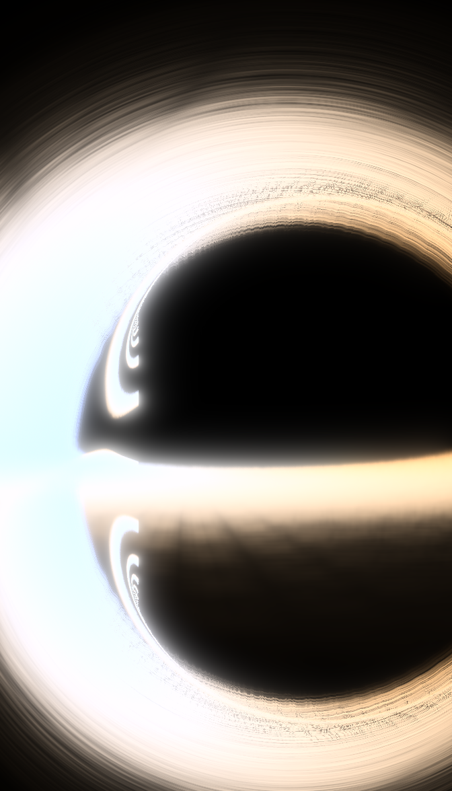
  
6x zoom onto the shadow's limb (12000 K scene): successive lensed images of the disc wind around the photon ring, each order ~23x thinner than the last (surface brightness is conserved, so each stays at full luminance until it falls below pixel scale; the grainy fringe is every deeper order averaging inside single pixels).

  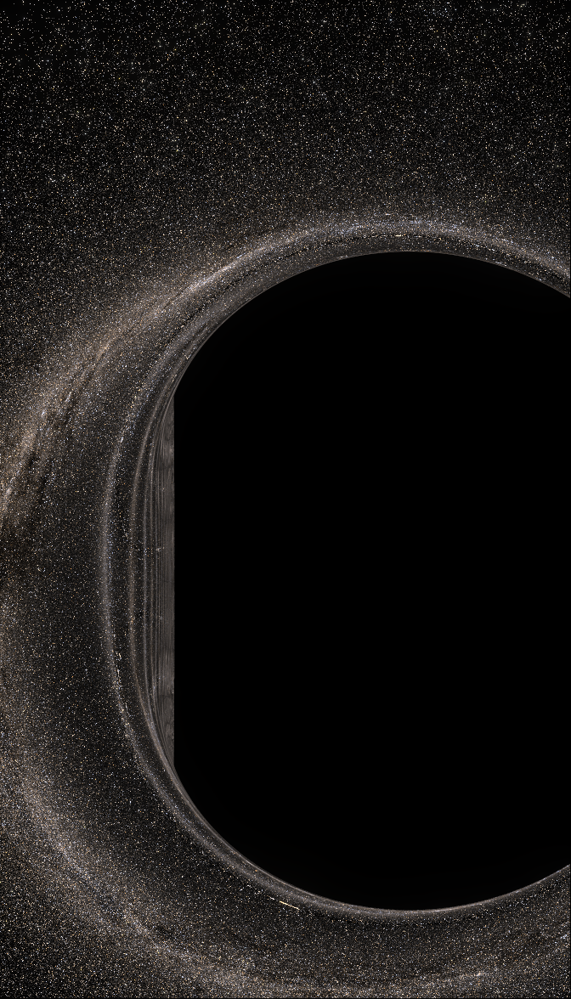
  
The control: the identical crop with the disc removed. The smooth boundary is the critical curve (its long straight stretch is the near-extremal "D-shape" flattening of the prograde limb at a/M = 0.998), and the faint concentric striations hugging it are the photon ring itself with only starlight as its source. Every winding in the image above slots into this scaffolding; same geometry, hot gas instead of faint stars as the paint.

### Animations

  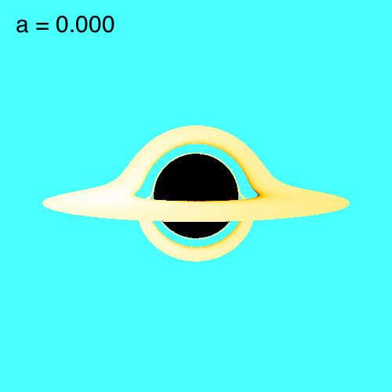
  
Animation of a spinning Kerr black hole with a rotating accretion disk

  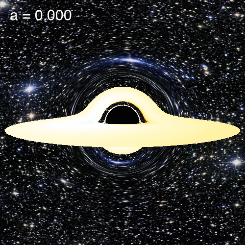
  
Animation of a Kerr black hole with background stars and a rotating accretion disk (background image: <a href="https://commons.wikimedia.org/wiki/File:Messier_object_025.jpg">M25</a>)

### Trajectories

  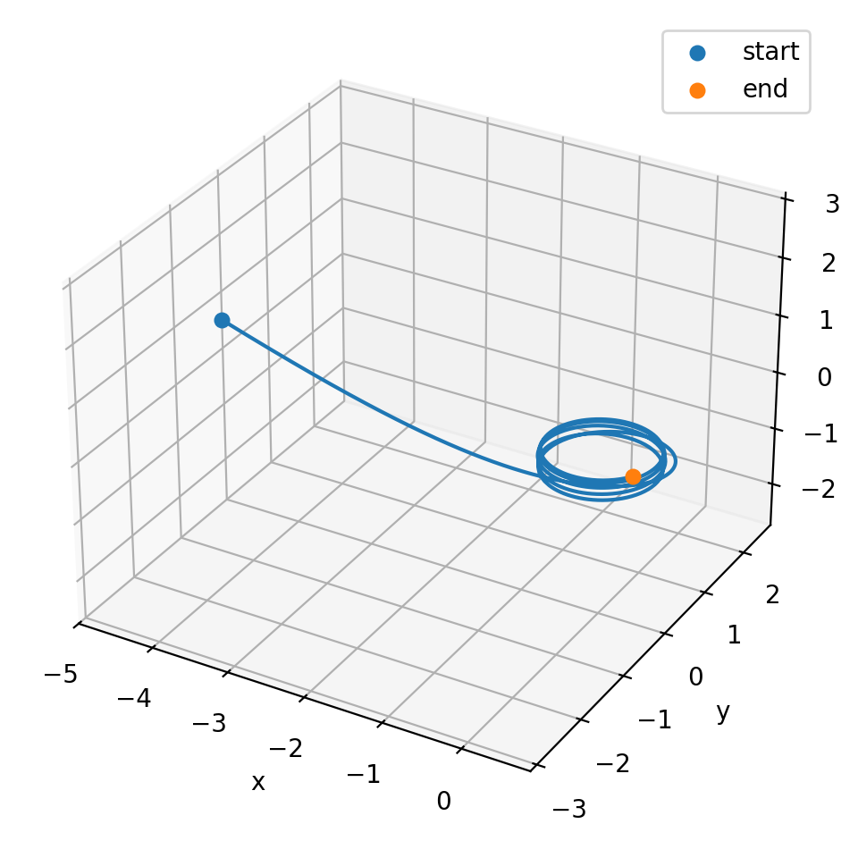
  
Visualization of a ray trajectory approaching the event horizon of a Kerr black hole

