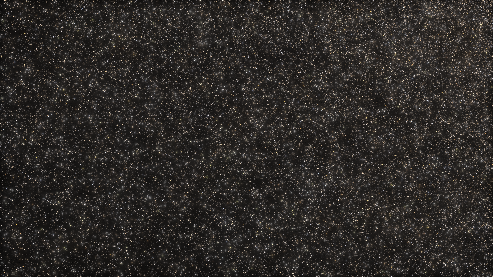
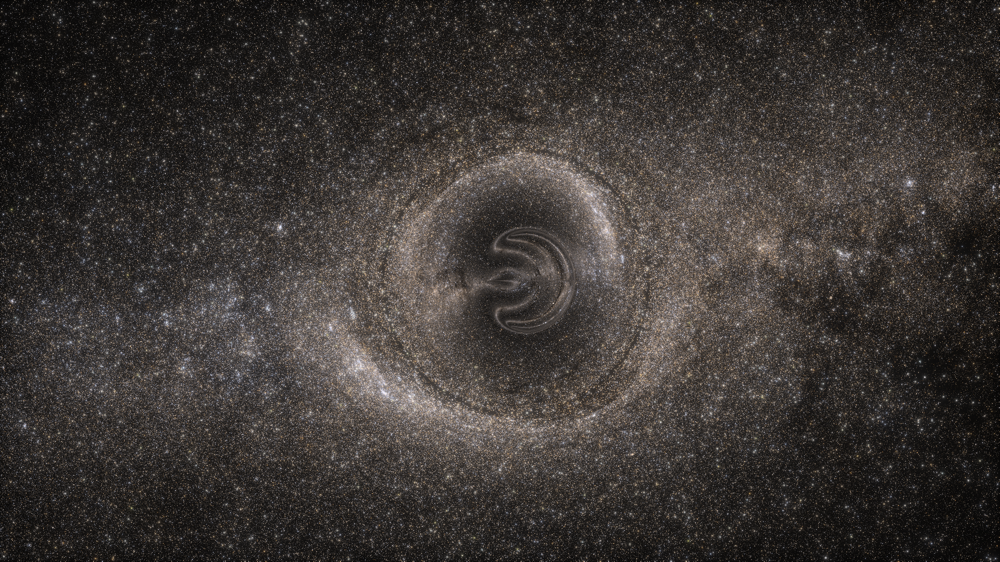
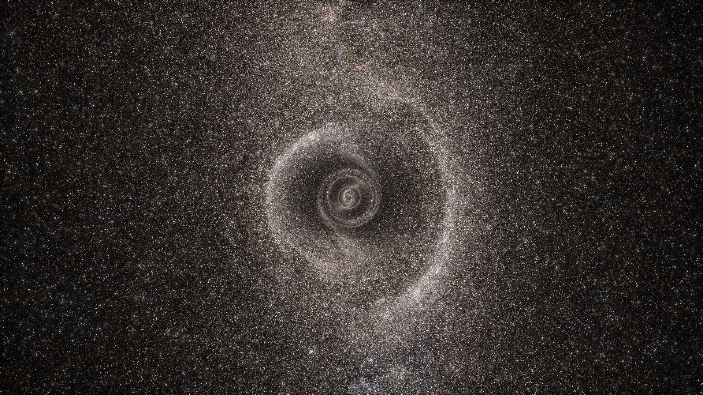
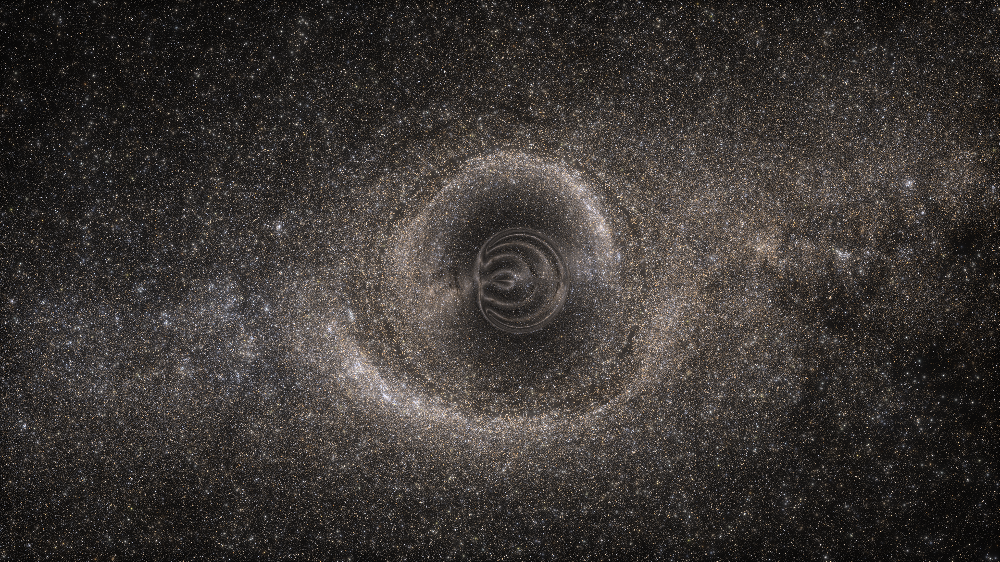
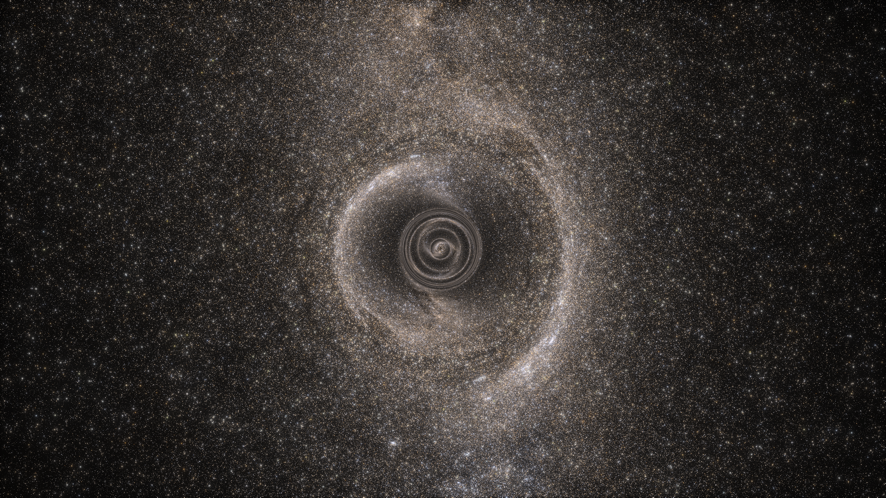
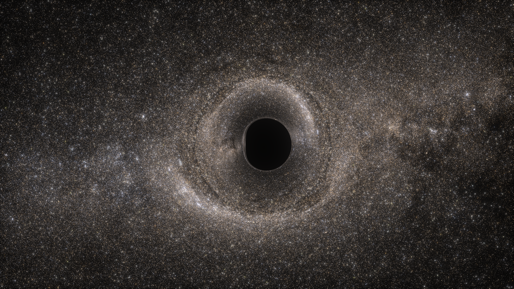
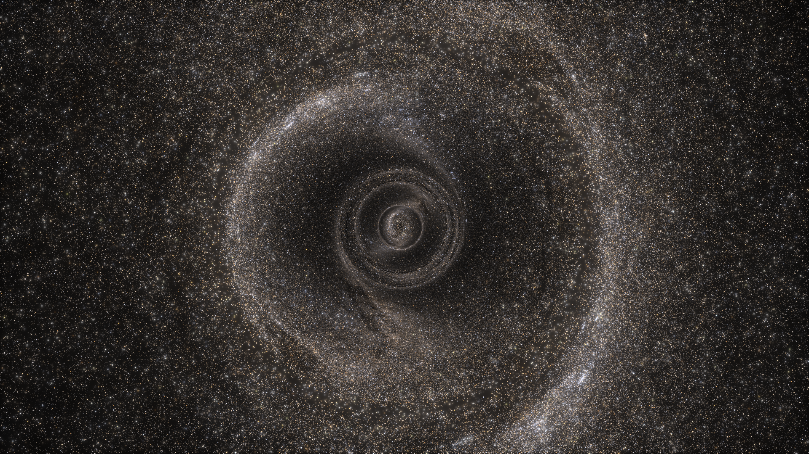
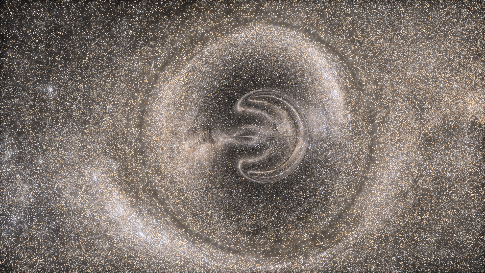

# Naked Singularity

[← Back to the gallery index](images.md)

Kerr with the spin taken past extremality, `a > M`. No event horizon forms, so
there is no shadow: where the black disc would be, you see light that passed
arbitrarily close to the ring singularity and wound around it. All frames use
`r_s = 1` (so `M = 0.5`), the real Gaia DR3 catalogue (G ≤ 12) as the only light
source, and no accretion disc.

The renderer handles `|a| > M` deliberately rather than by accident:
`Kerr::new` warns and `inside_horizon` returns false for every point, so the
horizon stop never fires and rays are free to spiral inward.

Each frame renders the full 45-degree view at 3200x1800 and evaluates only the
central 1600x900 (`--from-row=450 --to-row=1350 --from-col=800 --to-col=2400`),
which gives a 2x zoom at full resolution for the cost of 1600x900 pixels.
Recipe: `images/gaia-mag12-kerr-naked-singularity-no-disc-2026-09-26.toml`
(change `a` per frame); linear HDRs in [`raw/`](raw/README.md); grade
`--bloom 0.35 --tonemap aces` with the per-frame white recorded in each PNG's
metadata.

### The same view with no hole at all

Before the lensed frames, the sky they are made of. This is the identical
camera, sky patch, framing and grade, with the mass set to zero: `radius = 0`
makes the Kerr-Schild metric function vanish, so the metric is Minkowski and
rays travel straight. Same geometry, same tetrad, same code path, nothing
removed but the mass (recipe:
`images/kerr-massless-control-2026-09-27.toml`).

  
  
An even field of catalogue stars with no structure in it. Everything in the frames below -- the ring, the windings, the dark void around them -- is the geometry acting on this.

### Seen from the equatorial plane

  
  
a = 0.55, just past extremal. The ring closes, and inside it the light is wound into a knot rather than cut off by a horizon. The thin straight spike right of centre is an artifact of rays reaching r = 0.

  
  
a = 0.75. The same view at higher spin: the knot opens into a double spiral, and the ring itself is rounder.

### Seen down the spin axis

  
  
a = 0.55 from the axis. The windings resolve into nested concentric rings, each one an image of the sky at a further turn around the singularity.

  
  
a = 0.75 from the axis: fewer and wider rings than at 0.55. The dark speck at the exact centre is where 20 rays reached NaN coordinates at r = 0.

### The same camera, with a horizon

  
  
a = 0.499, below extremality, at an identical camera and grade. A horizon exists, so the interior structure of the frames above is replaced by a shadow bounded by the photon ring.

## The same frames against a chosen sky

The frames above sit against whatever patch of the catalogue their camera faces,
which for these vantages is among the sparsest in the sky. Rotating the
celestial sphere puts the highest-contrast patch behind the hole instead, so the
band is visibly dragged around the ring and the windings have something to be
images *of* (recipe: `images/kerr-naked-singularity-bsky-2026-09-27.toml`;
method: [`sky-survey/README.md`](sky-survey/README.md)). These are full-frame,
so the structure is smaller than in the 2x crops above; the two zoom frames at
the end give it at 1.8x.

  
  
a = 0.75 edge-on. The band enters from the left and wraps into the ring; the bright patches either side of it are lensed images of the denser parts.

  
  
a = 0.75 down the axis. Each concentric ring is the same band imaged one turn further around the singularity.

  
  
a = 0.55 edge-on: a tighter knot inside the ring than at 0.75.

  
  
a = 0.55 down the axis: more windings, packed closer together than at 0.75.

  
  
a = 0.499, the horizon control at the same camera, sky and grade: the interior structure is replaced by a shadow.

### Closer on the ring

Rendered at 3456x1944 with only the central 1920x1080 evaluated, a 1.8x zoom at
full resolution for the cost of the smaller frame.

  
  
a = 0.75 down the axis at 1.8x: the nested rings fill the frame, and each can be followed inward to the core.

  
  
a = 0.75 edge-on at 1.8x, graded lighter (white 0.05) because the rotated sky dominates the frame's luminance and would otherwise leave the ring dark.

