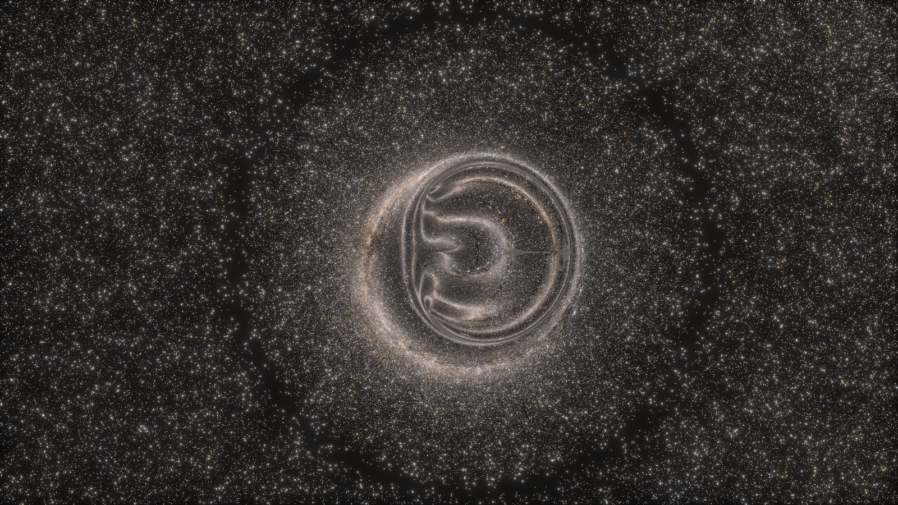
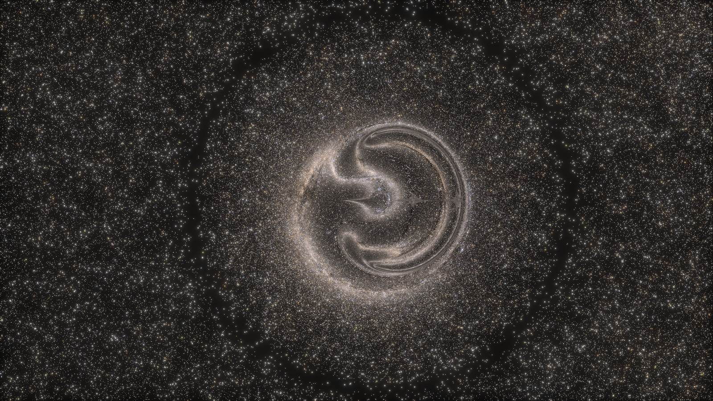
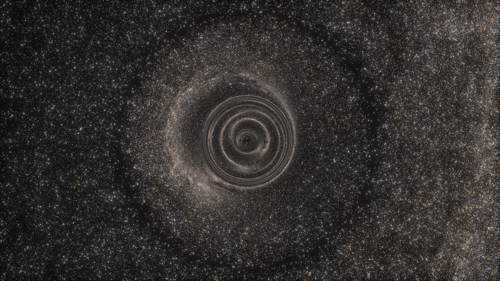
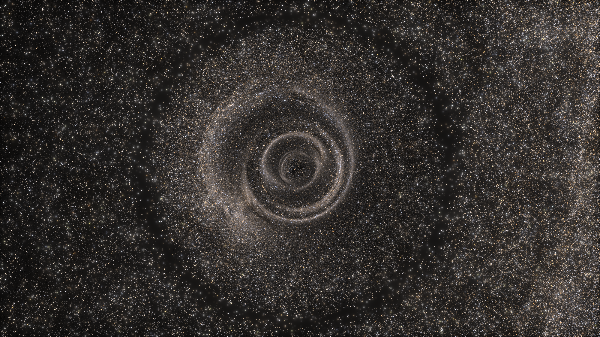
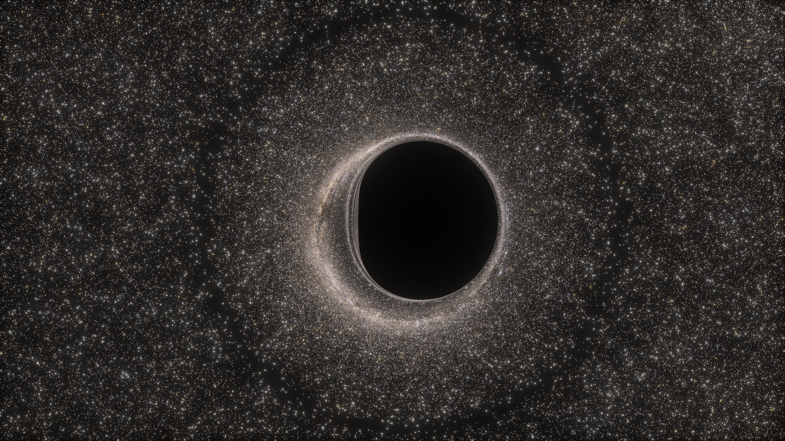

# Naked Singularity

[← Back to the gallery index](images.md)

Kerr with the spin taken past extremality, `a > M`. No event horizon forms, so
there is no shadow: where the black disc would be, you see light that passed
arbitrarily close to the ring singularity and wound around it. All frames use
`r_s = 1` (so `M = 0.5`), the real Gaia DR3 catalogue (G ≤ 12) as the only light
source, and no accretion disc.

The renderer handles `|a| > M` deliberately rather than by accident:
`Kerr::new` warns and `inside_horizon` returns false for every point, so the
horizon stop never fires and rays are free to spiral inward.

Each frame renders the full 45-degree view at 3200x1800 and evaluates only the
central 1600x900 (`--from-row=450 --to-row=1350 --from-col=800 --to-col=2400`),
which gives a 2x zoom at full resolution for the cost of 1600x900 pixels.
Recipe: `images/gaia-mag12-kerr-naked-singularity-no-disc-2026-09-26.toml`
(change `a` per frame); linear HDRs in [`raw/`](raw/README.md); grade
`--bloom 0.35 --tonemap aces` with the per-frame white recorded in each PNG's
metadata.

### Seen from the equatorial plane

  
  
a = 0.55, just past extremal. The ring closes, and inside it the light is wound into a knot rather than cut off by a horizon. The thin straight spike right of centre is an artifact of rays reaching r = 0.

  
  
a = 0.75. The same view at higher spin: the knot opens into a double spiral, and the ring itself is rounder.

### Seen down the spin axis

  
  
a = 0.55 from the axis. The windings resolve into nested concentric rings, each one an image of the sky at a further turn around the singularity.

  
  
a = 0.75 from the axis: fewer and wider rings than at 0.55. The dark speck at the exact centre is where 20 rays reached NaN coordinates at r = 0.

### The same camera, with a horizon

  
  
a = 0.499, below extremality, at an identical camera and grade. A horizon exists, so the interior structure of the frames above is replaced by a shadow bounded by the photon ring.

