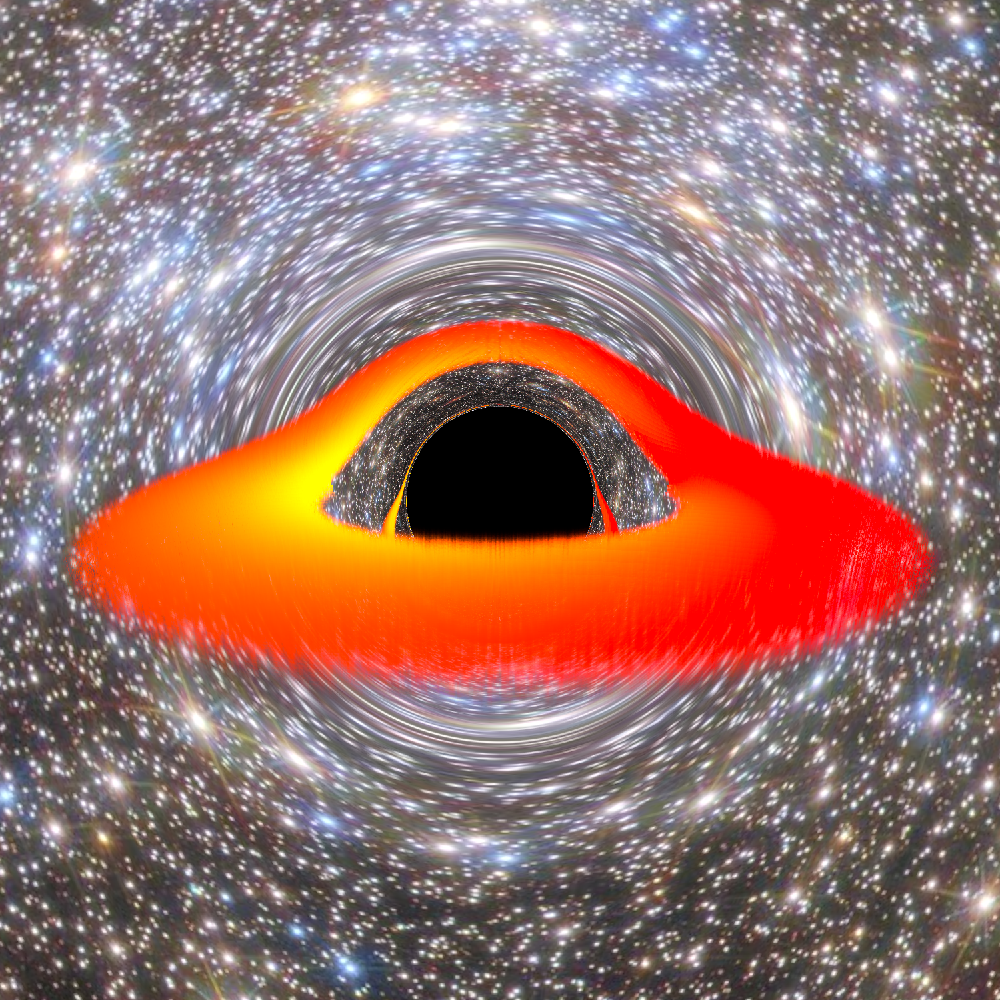

# Schwarzschild Black Hole

[← Back to the gallery index](images.md)

### Checkerboard Accretion Disk

  
  
Schwarzschild black hole with a checkerboard accretion disk showing gravitational lensing effects

### Volumetric Rendering

  
  
Schwarzschild black hole visualization with volumetric disc (background image: <a href="https://commons.wikimedia.org/wiki/File:NGC6355_-_HST_-_Potw2301a.jpg">NGC 6355</a>)

