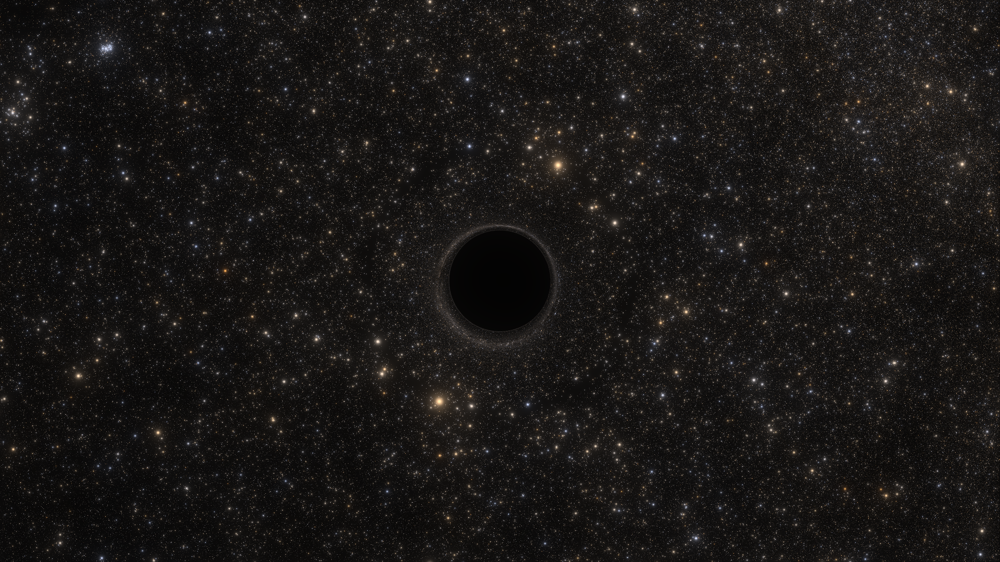
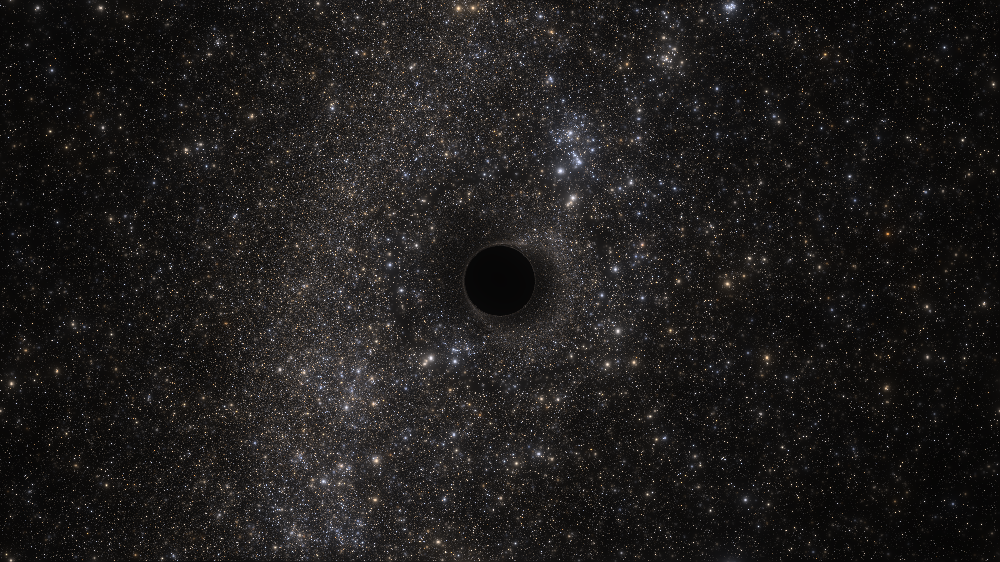
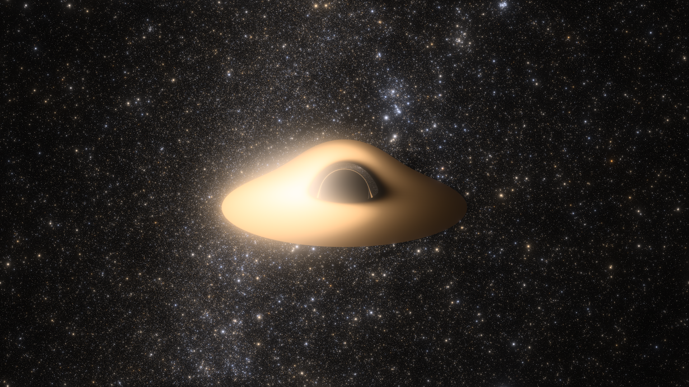
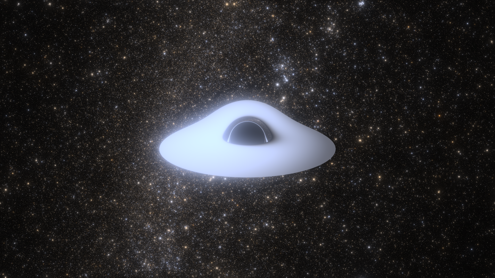
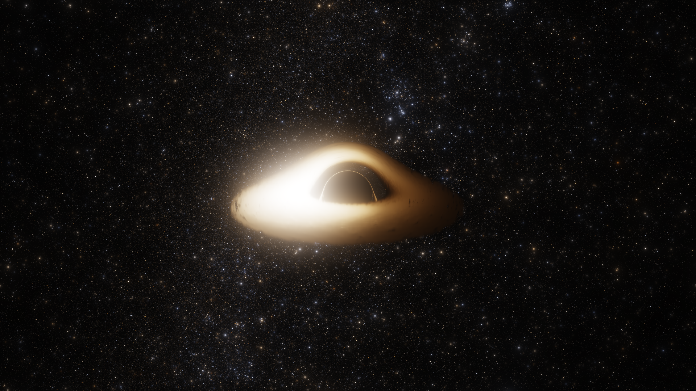
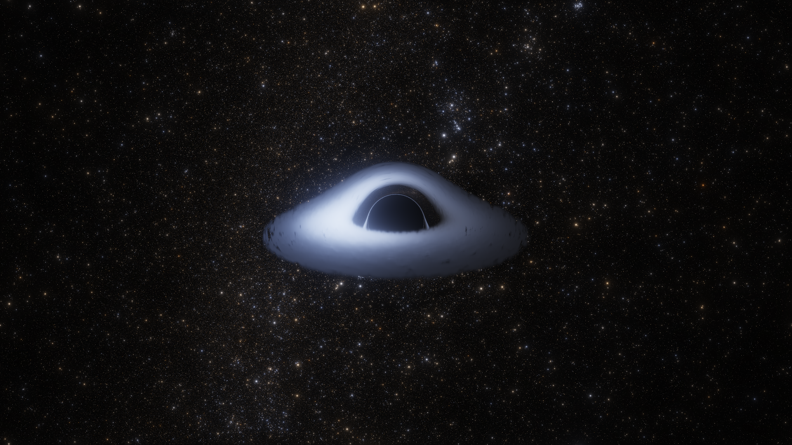
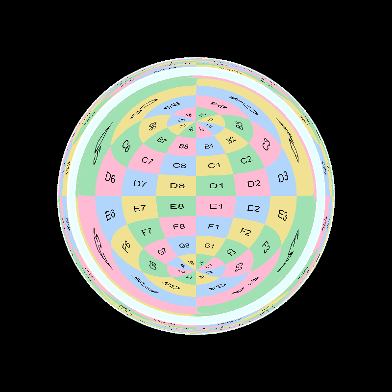
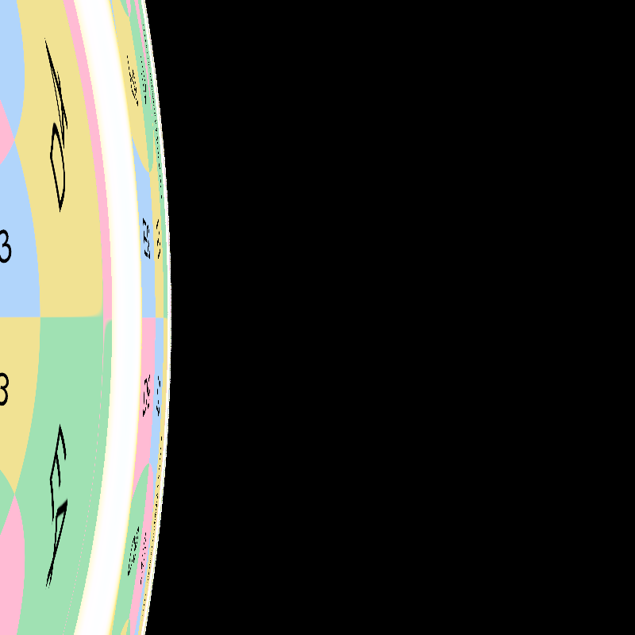
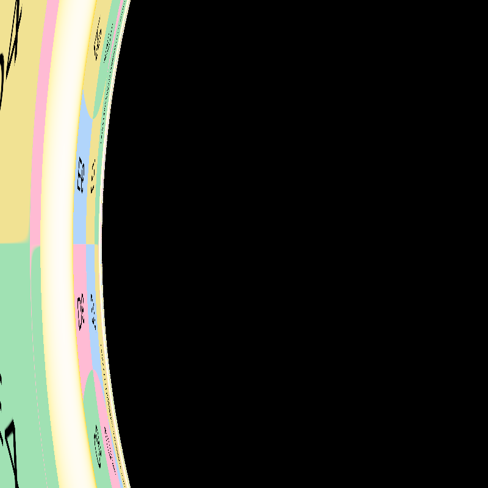
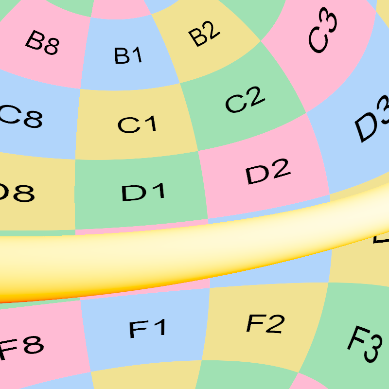

# Schwarzschild Black Hole

[← Back to the gallery index](images.md)

### Gaia star field

A Schwarzschild black hole lensing the real Gaia DR3 catalogue (G &le; 12) as
point-source stars, no accretion disc. The shadow and photon ring are perfectly
circular; the ring glow is clumpy only because the real sky is uneven (recipe:
`images/gaia-mag12-schwarzschild-no-disc-1920x1080-2026-09-21.toml`; rendered to
linear HDR and graded with bloom + a luminance-preserving ACES tone map at
exposure 86).

  
  
Gaia DR3 stars (G &le; 12) lensed by a Schwarzschild black hole, viewed edge-on from the &minus;x axis; 1920&times;1080 HDR, bloom + ACES.

The same star field from the vantage the disc images use (camera `0,-24,6.5`,
looking back at the hole), so the lensed sky patch matches those below (recipe:
`images/gaia-mag12-schwarzschild-no-disc-discview-1920x1080-2026-09-23.toml`;
same grade and exposure).

  
  
Same catalogue from the disc images' vantage: the sky patch here is the one the disc renders below sit in front of.

### Accretion disc over the Gaia star field

A flat Novikov-Thorne blackbody accretion disc rendered together with the real
Gaia DR3 (G &le; 12) star field in a single pass. The disc's `flux_scale` dims
its emitted light into the star field's brightness range while leaving its
opacity untouched, so the disc still fully occludes the stars behind it and one
exposure captures both. Rendered to linear HDR and graded with bloom and a
luminance-preserving ACES tone map (grading brightness while keeping
chromaticity, so the disc holds its colour instead of washing to white). Same
camera and star field in both; only the disc temperature differs
(recipes: `images/schwarzschild-disc-stars-yellow-1920x1080-2026-09-23.toml`,
`images/schwarzschild-disc-stars-blue-1920x1080-2026-09-23.toml`; exposure 86).
An HDR gain-map JPEG sits beside each PNG (`*-hdr.jpg`): an ordinary SDR JPEG
carrying a hidden gain map, so it shows the SDR image everywhere and brightens
the disc past white on an HDR screen (built with the macOS CoreImage HDR API).

  
  
Warm disc (4500 K): the bright left rim is the Doppler-boosted approaching side; the thin arc over the shadow is the lensed far side plus the photon ring.

  
  
Hot disc (15000 K): a blackbody this hot glows blue-white (it never reaches a saturated blue), so a brighter, more energetic-looking disc than the warm one.

### Volumetric accretion disc over the Gaia star field

A thick (volumetric) blackbody accretion disc over the Gaia DR3 (G &le; 12) star
field, single pass. Unlike the razor-thin flat disc, the gas has real thickness,
so its edge is a soft, fluffy falloff (no sharp outer rim) and its opacity comes
from the local gas density: the dim receding side still fully occludes the stars
behind it (dim in emission, unchanged in opacity), while only the tenuous outer
gas lets starlight bleed through. The disc's `flux_scale` dims its emitted light
into the star field's range so one exposure holds both. Graded from linear HDR
with bloom + ACES (recipes:
`images/schwarzschild-voldisc-stars-yellow-1920x1080-2026-09-23.toml`,
`images/schwarzschild-voldisc-stars-blue-1920x1080-2026-09-23.toml`). An HDR
gain-map JPEG (`*-hdr.jpg`) sits beside each PNG: an ordinary SDR JPEG carrying a
hidden gain map, so it shows SDR everywhere and brightens the disc past white on
an HDR screen.

  
  
Warm volumetric disc (4500 K). HDR version: <code>schwarzschild-voldisc-stars-yellow-1920x1080-2026-09-23-hdr.jpg</code>.

  
  
Hot volumetric disc (15000 K, blue-white). HDR version: <code>schwarzschild-voldisc-stars-blue-1920x1080-2026-09-23-hdr.jpg</code>.

### Checkerboard Accretion Disk

  
  
Schwarzschild black hole with a checkerboard accretion disk showing gravitational lensing effects

### Volumetric Rendering

  
  
Schwarzschild black hole visualization with volumetric disc (background image: <a href="https://commons.wikimedia.org/wiki/File:NGC6355_-_HST_-_Potw2301a.jpg">NGC 6355</a>)

### Close vantages

First-person views from a static observer close to the hole (recipes:
`images/create-vantage-images.sh`; checker sky, 3500 K blackbody disc so
gravitational blueshift keeps the gas in warm hues). The [Kerr
gallery](kerr.md#close-vantages) has the same four placements around a
spinning hole for comparison.

  
  
Porthole (r = 1.05 r_s, looking straight out): this close to the horizon the entire sky, disc included, is compressed into a shrinking circle of light; everything around it is the black hole filling the view.

  
  
Photon-sphere edge (r = 1.25 r_s, looking sideways): near the photon sphere at 1.5 r_s, sideways-directed light circles the hole; the bright wall is made of ever-tighter wound images of the disc and sky.

  
  
Grazing view from just above the photon sphere (r = 1.55 r_s): the band stacks multiple complete windings of the sky, each successive image thinner than the last.

  
  
Rearview (r = 2 r_s, looking away and slightly up): the outward sky, gravitationally magnified, with the accretion disc cutting through as a bright band.

