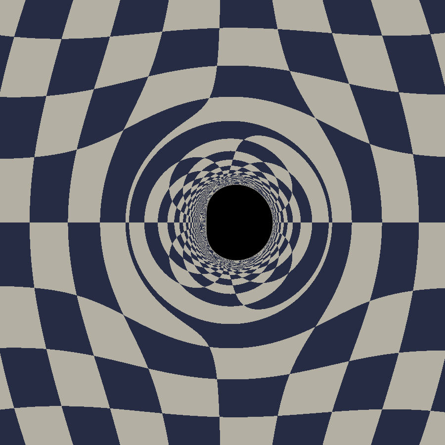
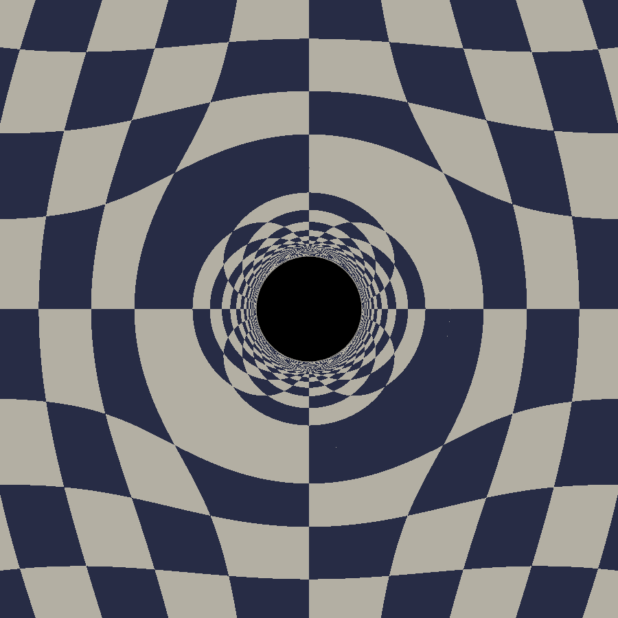
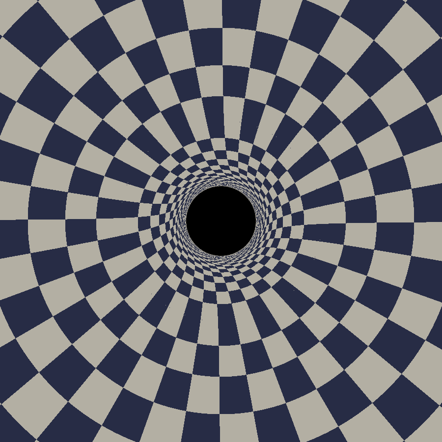
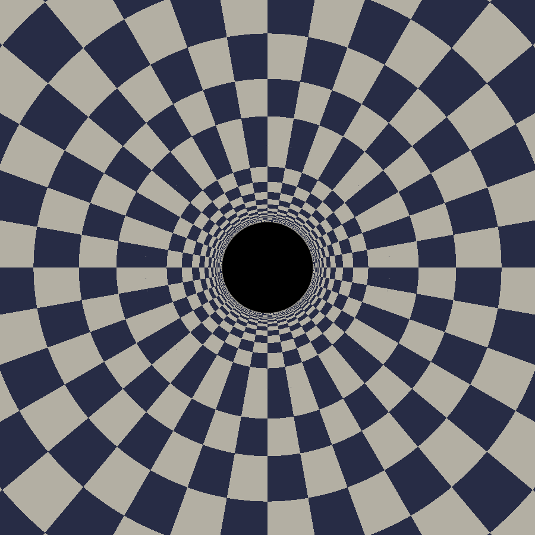
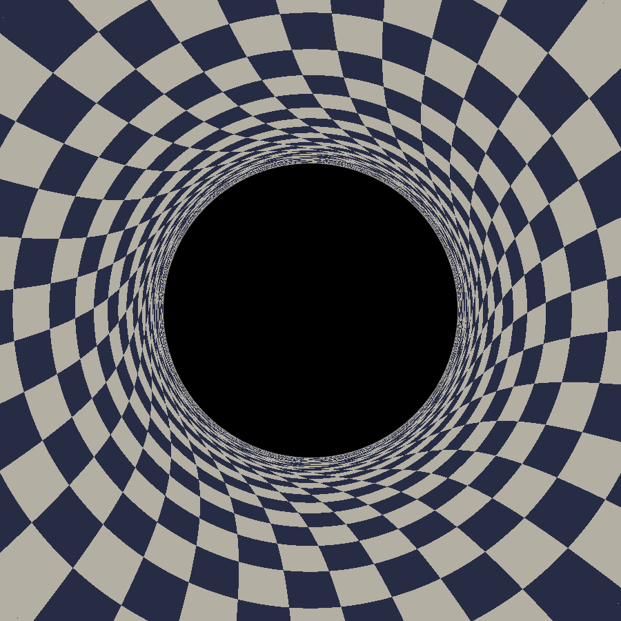
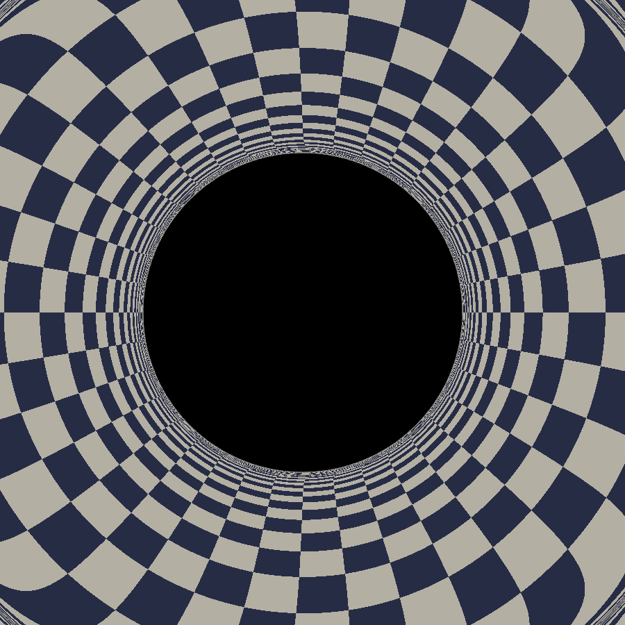
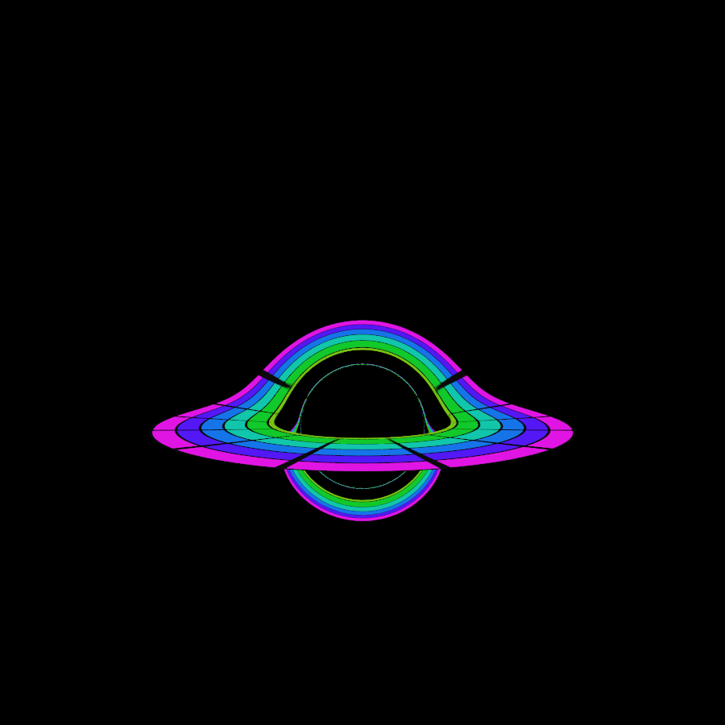

# Showcase

[← Back to the gallery index](images.md)

Pairs of renders that isolate individual GR effects with synthetic
textures. Each pair shares its camera exactly, so every difference between
the two images is purely the spin (a = 0.499, i.e. a/M = 0.998, vs a = 0).
Reproduce with `images/create-showcase-images.sh` (scene definitions in
`scene-definitions/showcase-*.toml`, disc bitmaps generated by
`scripts/generate_showcase_textures.py`).

### Shadow shape (equatorial view)

  
  
  
Top, a = 0.499: the shadow flattens on the prograde side (the "D" shape) and shifts off-center. Bottom, a = 0: a centered circle.

### Frame dragging (view down the spin axis)

  
  
  
Top, a = 0.499: the sky's radial spokes wind around the shadow, dragged by the hole's rotation. Bottom, a = 0: the same spokes stay ruler-straight to the photon ring.

  
  
  
3x zoom onto the shadow region, where the twist concentrates (it falls off roughly as 1/r^3, so the outer tiles are barely affected). Top, a = 0.499; bottom, a = 0.

### Lensing image orders (ring-and-spoke disc)

  
  
  
Rings are coded by absolute Boyer-Lindquist radius (same color = same r in both images); dark spokes reveal azimuthal shear between the direct image, the lensed far side over the shadow, and the underside image below it. Top, a = 0.499: gas reaches the prograde ISCO at r = 0.62 and hugs the shadow. Bottom, a = 0: the ISCO at r = 3 keeps the inner edge far out.

